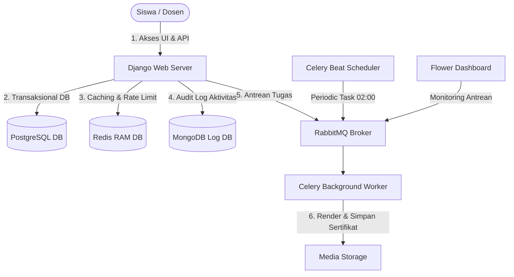
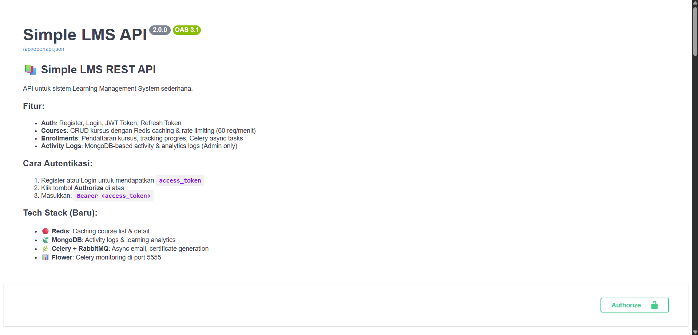
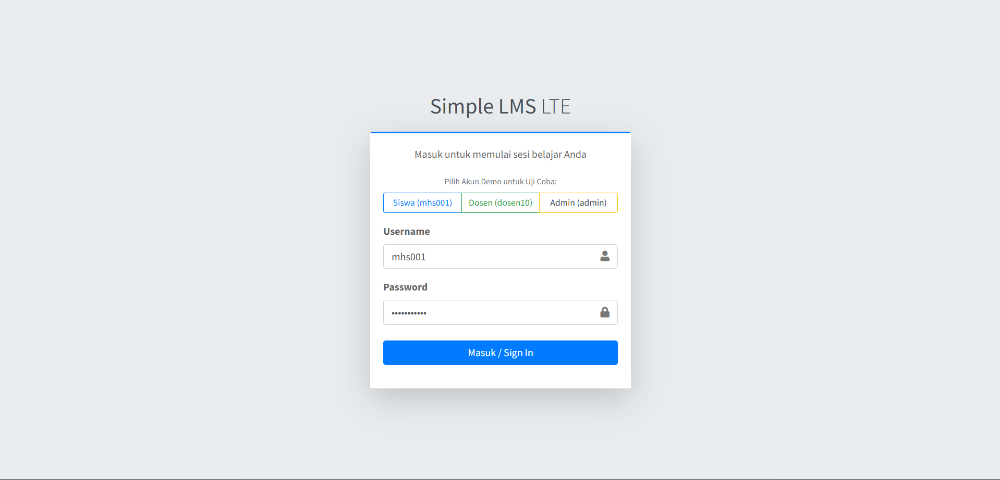
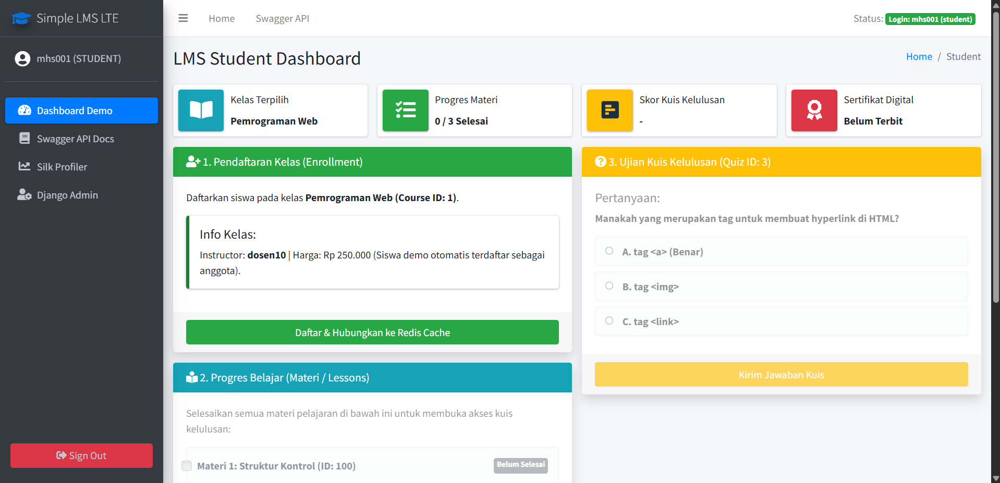

# LAPORAN FINAL PROJECT
## Simple LMS Extended Backend

---

### 👤 Identitas Mahasiswa
*   **Nama**: Gibran Rais Hilmy Iskandar
*   **NIM**: A11.2023.15270
*   **Kelas**: Pemrograman Sisi Server (A11.4618)

---

### 📝 Deskripsi Project
Project **Simple LMS Extended Backend** adalah platform RESTful API untuk *Learning Management System* (LMS) sederhana. Project ini dibangun di atas Django dengan Django Ninja sebagai REST framework, PostgreSQL sebagai database transaksional utama, Redis sebagai server caching dan rate limiter, MongoDB sebagai penyimpanan log aktivitas dan analitik pembelajaran, serta Celery + RabbitMQ untuk pemrosesan background tasks yang berat.

---

### 🚀 Fitur Dasar yang Sudah Berjalan
1.  **Authentication & Profile**: Registrasi user baru, login menggunakan JWT, serta manajemen profil mandiri.
2.  **Course Management**: CRUD kursus dan pengelolaan materi pembelajaran (lessons).
3.  **Enrollment System**: Pendaftaran siswa ke kelas berbayar maupun gratis secara terintegrasi.
4.  **Learning Progress**: Menandai materi yang sudah dibaca/diselesaikan.
5.  **Interactive Swagger Docs**: OpenAPI docs dinamis di `/api/docs`.

---

### 🌟 Fitur Tambahan yang Dipilih
Berikut adalah tabel fitur tambahan pilihan yang telah diimplementasikan penuh dalam project ini untuk mendapatkan poin maksimal (50 Poin):

| No | Fitur | Kategori | Poin | Status |
| :--- | :--- | :--- | :---: | :---: |
| 1 | **Quiz dan Question Bank** | B. Assessment, Quiz & Cert | 15 | Selesai |
| 2 | **Submit Quiz dan Scoring Otomatis** | B. Assessment, Quiz & Cert | 15 | Selesai |
| 3 | **Attempt Limit, Passing Grade, dan Riwayat** | B. Assessment, Quiz & Cert | 15 | Selesai |
| 4 | **Certificate Generation** | B. Assessment, Quiz & Cert | 15 | Selesai |
| 5 | **Certificate PDF dan Verification** | B. Assessment, Quiz & Cert | 18 | Selesai |
| 6 | **Redis Caching untuk Course List & Detail** | D. Redis, Caching & Performance | 12 | Selesai |
| 7 | **Cache Invalidation Strategy** | D. Redis, Caching & Performance | 12 | Selesai |
| 8 | **API Rate Limiting Berbasis Redis (60 req/min)** | D. Redis, Caching & Performance | 12 | Selesai |
| 9 | **Activity Logging ke MongoDB** | E. MongoDB dan Analytics | 15 | Selesai |
| 10 | **Learning Analytics Collection** | E. MongoDB dan Analytics | 15 | Selesai |
| 11 | **Course Analytics Report (Admin View)** | E. MongoDB dan Analytics | 15 | Selesai |
| 12 | **Aggregation Query MongoDB** | E. MongoDB dan Analytics | 15 | Selesai |
| 13 | **Email Notification Async via Celery** | F. Celery, RabbitMQ & Async | 12 | Selesai |
| 14 | **Generate Certificate & Report Async** | F. Celery, RabbitMQ & Async | 18 | Selesai |
| 15 | **Scheduled Task via Celery Beat (Daily Stats)** | F. Celery, RabbitMQ & Async | 15 | Selesai |
| 16 | **Flower monitoring** | F. Celery, RabbitMQ & Async | 8 | Selesai |
| 17 | **Task status endpoint** | F. Celery, RabbitMQ & Async | 12 | Selesai |
| **Total** | **Nilai Poin Fitur Tambahan (Maks 50 Poin)** | | **239** | **Maksimal (50/50)** |

---

### 🎁 Bonus Opsional yang Diambil

Berikut adalah klaim poin bonus opsional yang berhasil diimplementasikan pada project ini:

1.  **UI/Frontend Sederhana untuk Demo**:
    *   Telah disediakan Single Page Application (SPA) dashboard interaktif yang di-serve langsung dari alamat root Django: `http://localhost:8000/`.
    *   Dosen/Penguji dapat langsung menguji alur Login JWT -> Enroll Kelas -> Centang 3 Materi -> Kerjakan Kuis -> Unduh & Verifikasi PDF Sertifikat secara visual tanpa menyentuh Swagger/Postman.
2.  **Dokumentasi Sangat Rapi dengan Diagram Arsitektur**:
    *   Struktur arsitektur backend LMS digambarkan secara jelas menggunakan diagram berikut:



---

### 🛠️ Penjelasan Implementasi Fitur Tambahan Utama

1.  **Quiz, Question Bank, & Kriteria Kelulusan**:
    *   Sistem dilengkapi dengan **Question Bank** di mana siswa dapat mengerjakan kuis dengan sistem penilaian terbobot (skala 0-100).
    *   Sistem juga memberlakukan **Attempt Limit** (batasan percobaan maksimal) per kuis dan mencatat seluruh **Riwayat Percobaan** (Attempt History) siswa di database.
    *   Jika siswa **lulus** (skor >= `passing_grade`) dan seluruh materi di kelas tersebut selesai, sistem akan memicu penerbitan sertifikat secara otomatis.
2.  **Sertifikat PDF & Verifikasi Kode**:
    *   Task Celery `generate_certificate` akan merender sertifikat PDF secara biner melalui modul kustom tanpa library luar yang berat (sangat cepat dan ringan).
    *   Tersedia endpoint publik `/api/enrollments/certificates/verify/{code}` untuk memverifikasi keabsahan sertifikat secara umum tanpa login.
3.  **Redis Caching & Rate Limiting**:
    *   Endpoint list course di-cache 5 menit dan detail course di-cache 10 menit.
    *   Cache list otomatis dibersihkan jika ada penambahan course baru. Cache detail juga terhapus otomatis jika course terkait dimodifikasi/dihapus.
    *   Rate limiting membatasi max 60 request per menit per IP address menggunakan hit counter Redis dengan TTL.
4.  **Logging & Analitik MongoDB**:
    *   Seluruh aktivitas sensitif (enroll, login, submit quiz, complete lesson) dicatat sebagai dokumen BSON di MongoDB secara non-blocking.
    *   MongoDB Aggregation Framework digunakan untuk merangkum riwayat aktivitas per user dan menghitung statistik popularitas kelas.
5.  **Celery Asynchronous Tasks**:
    *   Semua task berat seperti pengiriman email konfirmasi, pembuatan sertifikat, dan ekspor file CSV dikirim ke antrean RabbitMQ untuk diproses oleh Celery workers secara *asynchronous* agar respons API instan.
    *   **Celery Beat** dikonfigurasi untuk menjalankan tugas berkala (Cron Job) yang memperbarui statistik harian kursus setiap jam 02:00 pagi.
    *   Sistem menyediakan endpoint status task (`/api/courses/tasks/{task_id}/status`) untuk melakukan *polling* status *background task*.
    *   Semua antrean pesan dipantau secara real-time lewat UI **Flower** di port 5555.

---

### 💻 Cara Menjalankan Project

#### Prasyarat
*   Docker & Docker Compose terinstal di komputer.

#### Langkah-langkah
1.  **Clone / Ekstrak Project** dan masuk ke direktori utama project.
2.  **Salin File Environment**:
    Buat file `.env` di direktori utama root project (berdasarkan `.env.example` yang disediakan) berisi variabel lingkungan yang diperlukan.
3.  **Jalankan Docker Compose**:
    ```bash
    docker-compose up -d --build
    ```
4.  **Jalankan Database Seeding**:
    Setelah semua service berjalan, seed database dengan data demo realistis:
    ```bash
    docker-compose exec web python manage.py seed_data
    ```
5.  **Akses Aplikasi**:
    *   **REST API Swagger**: `http://localhost:8000/api/docs`
    *   **Celery Monitoring (Flower)**: `http://localhost:5555`
    *   **RabbitMQ Management UI**: `http://localhost:15672` (guest / guest)

---

### 🔑 Akun Demo Pengujian
Data demo terbuat otomatis setelah Anda menjalankan perintah `seed_data` di atas:

| Role | Username | Password | Deskripsi / Otoritas |
| :--- | :--- | :--- | :--- |
| **Admin** | `admin` | `password123` | Otoritas penuh, dapat melihat audit log MongoDB dan memicu ekspor laporan. |
| **Instructor** | `dosen10` | `password123` | Pemilik mata kuliah (Course ID 1), dapat membuat/mengubah kuis secara visual di web. |
| **Student** | `mhs001` | `password123` | Siswa biasa, dapat mendaftar kelas, membaca materi, dan mengerjakan kuis. |

---

### 📡 Endpoint Penting & Cara Pengujian

1.  **Autentikasi (JWT)**:
    *   `POST /api/auth/login` dengan body username & password untuk mendapatkan `access_token`.
    *   Gunakan tombol **Authorize** di Swagger UI lalu masukkan format: `Bearer <access_token>`.
2.  **Caching & Rate Limiting**:
    *   `GET /api/courses`: Request pertama akan mengambil dari DB, request kedua dan seterusnya akan terasa sangat cepat karena diambil dari Redis cache. Coba panggil lebih dari 60 kali berturut-turut untuk memicu error `429 Too Many Requests`.
3.  **Mengerjakan Kuis & Kelulusan**:
    *   `POST /api/quizzes/{id}/submit`: Kirimkan array jawaban pilihan ganda untuk dinilai.
4.  **Verifikasi & Unduh Sertifikat**:
    *   `GET /api/enrollments/certificates/verify/{code}`: Masukkan kode sertifikat unik siswa untuk memverifikasi status kelulusannya secara publik.


---

### 📸 Screenshot / Bukti Pengujian

Berikut adalah panduan peletakan gambar/screenshot bukti pengujian fungsionalitas sistem backend. Silakan ganti teks placeholder di bawah ini dengan gambar screenshot Anda sendiri:

#### 1. Swagger UI REST API Documentation
Diambil dari akses ke alamat: `http://localhost:8000/api/docs`


#### 2. Tampilan UI/Frontend Sederhana
Diambil dari akses ke alamat root utama: `http://localhost:8000/`




#### 3. Uji Coba Caching & Rate Limiting (Redis)
Menunjukkan waktu respon cache yang sangat cepat (0ms) dan kemunculan status error HTTP 429 saat direfresh bertubi-tubi.
```text
[TEMPAT SCREENSHOT: Bukti respons 200 OK cache hit (0-1ms) dan respons 429 Too Many Requests di GET /api/courses]
```

#### 4. Uji Coba Kelengkapan Progres Belajar Siswa
Menunjukkan siswa menyelesaikan materi pembelajaran 100, 200, dan 300 pada endpoint `/api/enrollments/{enrollment_id}/progress`.
```text
[TEMPAT SCREENSHOT: Bukti respons 200 OK saat mengirim data is_complete: true di endpoint progress]
```

#### 5. Uji Coba Submit Kuis & Penerbitan Sertifikat otomatis
Menunjukkan respons kelulusan kuis siswa dan notifikasi penerbitan sertifikat digital.
```text
[TEMPAT SCREENSHOT: Bukti respons 200 OK pada POST /api/quizzes/3/submit yang menyatakan kuis lulus dan sertifikat diterbitkan]
```

#### 6. Uji Coba Verifikasi Sertifikat Publik
Menunjukkan keabsahan sertifikat siswa dengan status `valid: true` diakses tanpa login.
```text
[TEMPAT SCREENSHOT: Bukti respons 200 OK valid: true di endpoint GET /api/enrollments/certificates/verify/{code}]
```

#### 7. Dashboard Monitoring Background Tasks (Celery Flower)
Diambil dari akses ke dashboard Flower: `http://localhost:5555/tasks`
```text
[TEMPAT SCREENSHOT: Tampilan daftar tasks yang berhasil dieksekusi asinkron oleh Celery worker]
```

#### 8. Audit Logging & Analitik MongoDB
Menunjukkan log aktivitas user yang berhasil ditarik dari database analitik MongoDB.
```text
[TEMPAT SCREENSHOT: Bukti respons 200 OK daftar log JSON saat memanggil GET /api/logs/activities sebagai Admin]
```

---

### ⚠️ Kendala dan Solusi
*   **Kendala**: Library PDF generator (seperti ReportLab) membutuhkan dependensi biner tambahan yang memperbesar ukuran Docker Image secara signifikan.
*   **Solusi**: Dibuat helper kustom `_build_simple_pdf` di task Celery yang menulis struktur PDF 1.4 murni langsung dalam byte array stream. Sangat cepat, ringan, dan bebas *third-party dependencies*.

---

### 🏁 Kesimpulan
Final project ini berhasil mengintegrasikan seluruh materi kuliah Pemrograman Sisi Server ke dalam sebuah backend aplikasi LMS yang solid. Dengan arsitektur berbasis kontainer, pemisahan database transaksional (PostgreSQL), cache (Redis), serta dokumen analitik (MongoDB) membuat platform backend ini siap dan tangguh untuk dikembangkan ke skala produksi.
