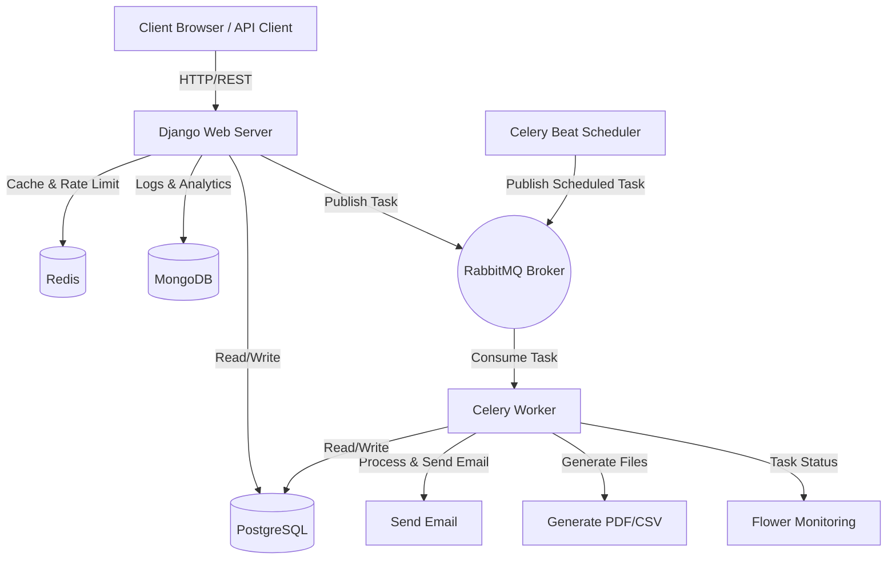

# Simple LMS - Advanced Features & Integration (Progress 4)

## Architecture Diagram



## Caching Strategy Explanation

### 1. Course List Caching
- **Endpoint**: `GET /api/courses`
- **Strategy**: Cache hasil response pencarian dan list course dengan key unik berdasarkan parameter (page, page_size, level, min_price, max_price, search). 
- **TTL**: 5 menit (300 detik).
- **Alasan**: Mencegah query berat ke database saat banyak user melihat halaman list course yang sama.

### 2. Course Detail Caching
- **Endpoint**: `GET /api/courses/{id}`
- **Strategy**: Cache detail spesifik dari satu course dengan key `course_detail:{id}`.
- **TTL**: 10 menit.
- **Alasan**: Detail course lebih jarang berubah dan sering diakses ketika user ingin melihat deskripsi atau silabus, sehingga layak di_cache agar load lebih cepat.

### 3. Cache Invalidation
- **Trigger**: Setiap ada Create, Update, atau Delete pada Course (dilakukan oleh Instructor/Admin).
- **Proses**: Method `_invalidate_course_cache` akan dipanggil. Method ini akan menghapus semua list pattern `"lms:course_list:*"` untuk mengosongkan cache hasil filter lama. Jika ini proses Update/Delete, key detail course terkait (`"lms:course_detail:{id}"`) juga akan dihapus.

### 4. Rate Limiting
- **Endpoint Limit**: `GET /api/courses`
- **Mekanisme**: Menggunakan cache Redis, menyimpan hit counter dengan key berbasis IP address (`rate_limit:courses_list:{ip}`).
- **Aturan**: Max 60 request per IP, dengan TTL (expiration) 60 detik. Jika counter lebih besar atau sama dengan 60, request ditolak dengan Exception (HTTP 429).


## Task Flow Documentation (Celery)

### 1. Send Enrollment Email
- **Type**: Asynchronous Task (`send_enrollment_email`)
- **Trigger**: Dipanggil (menggunakan `.delay()`) ketika user melakukan pendaftaran course via `POST /api/enrollments`.
- **Flow**: User Mendaftar -> Django menyimpan Data Enrollment -> Django meletakkan Task di RabbitMQ -> Mereturn respons Enrollment Berhasil segera -> Worker mengeksekusi Task (Mengambil Email User) -> Mengirim email konfirmasi -> Selesai.

### 2. Generate Certificate
- **Type**: Asynchronous Task (`generate_certificate`)
- **Trigger**: Dipanggil setelah user menyelesaikan sebuah materi/lesson (`PATCH /api/enrollments/progress/{course_id}/{lesson_id}`).
- **Flow**: User menandai lesson "lengkap" -> Django update progress -> Jika semua lesson telah lengkap untuk enrollment tersebut -> Django publish Task ke RabbitMQ -> Worker mengeksekusi task -> Cek kriteria, render PDF, save ke `media/certificates` -> Selesai.

### 3. Update Course Statistics 
- **Type**: Scheduled / Periodic Task (`update_course_statistics`)
- **Trigger**: Dipanggil otomatis melalui Celery Beat sesuai jadwal CRON (dalam sistem berjalan harian jam 2 pagi).
- **Flow**: Celery Beat timer tercapai -> Publish task ke Broker RabbitMQ -> Worker menerima task -> Query count tiap active enrollment course -> Print/Log (bisa diubah agar memutasi model agregat) -> Selesai.

### 4. Export Course Report
- **Type**: Asynchronous Task (`export_course_report`)
- **Trigger**: Manual oleh admin via API `POST /api/courses/export-report`.
- **Flow**: Admin memicu request export CSV -> Django memanggil Task asinkron -> Kembalikan 202 ke Admin -> Worker meng-query database -> Menulis file ke disk `media/reports/report_...csv` -> Selesai.


## Redis CLI Commands Documentation (Monitoring & Troubleshooting)

Berikut beberapa command yang dapat dijalankan langsung via `redis-cli` (atau docker exec -it <redis-container> redis-cli) untuk memonitor cache dan rate-limit yang sedang aktif.

1. **Test koneksi ke Redis**
   ```bash
   ping
   ```

2. **Melihat isi key yang aktif dengan pattern**
   ```bash
   # Melihat semua key yang berhubungan dengan course_list
   keys lms:course_list:*
   
   # Melihat semua detail course
   keys lms:course_detail:*
   
   # Melihat catatan rate limit 
   keys lms:rate_limit:*
   ```

3. **Membaca isi value spesifik dari key**
   ```bash
   get lms:course_detail:1
   ```

4. **Mengecek sisa waktu (TTL) dari sebuah key dalam detik**
   ```bash
   # Mengetahui kapan blokir rate-limit habis atau umur cache content
   ttl "lms:rate_limit:courses_list:127.0.0.1"
   ```

5. **Memonitor semua command yang masuk ke Redis secara Real-Time**
   *(Gunakan dengan hati-hati pada environment production sibuk)*
   ```bash
   monitor
   ```

6. **Menghapus semua database / Memicu Invalidation Manual**
   ```bash
   flushdb   # Hapus DB yang sedang aktif 
   flushall  # Hapus semua item di semua DB
   ```

---

## 💻 Cara Menjalankan Project (Docker)

### 1. Prasyarat
Pastikan Anda sudah menginstal **Docker** dan **Docker Compose** di sistem Anda.

### 2. Konfigurasi Environment File
Buat berkas `.env` di dalam folder `code/` jika belum tersedia, kemudian masukkan konfigurasi database, redis, dan mongo yang sesuai (sesuai contoh di `docker-compose.yml`).

### 3. Build & Jalankan Container
Jalankan perintah berikut untuk mengunduh image, melakukan build, dan menjalankan seluruh container di background:
```bash
docker-compose up -d --build
```

### 4. Database Migration & Seeding
Setelah container berjalan, lakukan migrasi database dan masukkan data dummy awal:
```bash
# Jalankan migrasi tabel PostgreSQL
docker-compose exec web python manage.py migrate

# Seed data dummy (pengajar, mahasiswa, course, dll)
docker-compose exec web python manage.py seed_data
```

### 5. Akses Layanan Aplikasi
*   **Web Dashboard Interaktif (Siswa, Instruktur, Admin)**: [http://localhost:8000/](http://localhost:8000/)
*   **REST API Swagger UI**: [http://localhost:8000/api/docs](http://localhost:8000/api/docs)
*   **Celery Flower Dashboard**: [http://localhost:5555](http://localhost:5555)
*   **RabbitMQ Management**: [http://localhost:15672](http://localhost:15672) (Username/Password: `guest`)

---

## 🔑 Akun Demo Default

Setelah menjalankan `seed_data`, Anda dapat menguji API menggunakan akun demo berikut:

| Role | Username | Password | Deskripsi / Otoritas |
| :--- | :--- | :--- | :--- |
| **Admin** | `admin` | `password123` | Mengelola seluruh resource, melihat log aktivitas analitik MongoDB. |
| **Instructor** | `dosen10` | `password123` | Membuat kursus, mengelola materi (lesson), dan membuat kuis. |
| **Student** | `mhs001` | `password123` | Melakukan pendaftaran (enroll), membaca materi, dan menjawab kuis. |